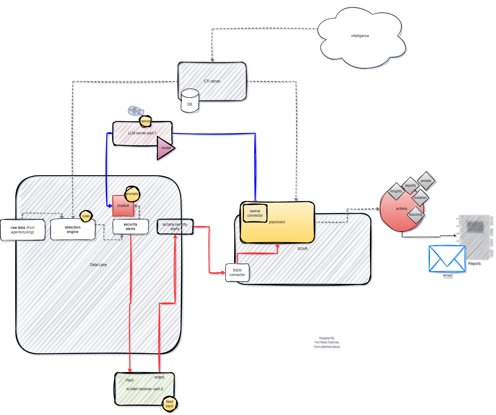

### AI-Driven Security Operations Center (SOC) – Architecture Overview

This architecture represents a next-generation **AI-driven SOC** that fuses traditional detection pipelines with LLM-based automation and decision support systems to enhance cyber threat response, reduce analyst workload, and accelerate resolution.

---

### Core Components:

1. **Data Ingestion & Detection Pipeline (Data Lake)**

   * Ingests **raw data** from agents/sensors (syslog, XDR, etc.).
   * Feeds data into a **Detection Engine**, which applies rules to generate security alerts.
   * Alerts are passed to a **Chatbot** powered by a **local LLM (LLM server - onPrem)** for contextual analysis and enrichment using tailored prompts.

2. **AI Alert Resolver**

   * The **AI-Alert Resolver Bot** receives alerts and LLM-generated analysis for automated triage.
   * Provides structured output (contextual summaries, threat levels, recommended actions) and **feedback loop** to fine-tune detection models or prompts.

3. **CTI Server Integration**

   * Connects to external **Cyber Threat Intelligence** sources and stores actionable intel in a local CTI DB.
   * Feeds the LLM and SOAR with up-to-date intelligence for contextual awareness.

4. **SOAR Platform**

   * Executes **automated playbooks** for triage, containment, blocking, or reporting using insights from the AI resolver and threat intelligence.
   * Includes an **OpenAI Connector** to allow the SOAR to query external LLMs (e.g., ChatGPT) for additional decision support when necessary.

5. **Action Engine & Reporting**

   * From SOAR, actionable outcomes include:

     * Email alerts
     * Isolation or blocking
     * Analyst reports
     * Executive-level insights
   * All actions are logged and monitored for reporting and compliance.

---

### AI Integration Highlights:

* **LLM Server (on-premise)**: Hosts different **“Modes”** (e.g., Creep Mode, GPT Online Mode) tailored to perform alert summarization, threat explanation, and response recommendation.
* **Prompt Engineering**: Prompts are dynamically created to interact with the LLM and generate actionable intelligence.
* **Feedback Loop**: Ensures continuous improvement of the detection and AI enrichment process based on incident outcomes.

---

### Key Advantages:

* **Human-AI Hybrid Response**: Augments analyst capabilities with AI, allowing faster and more precise response.
* **On-Prem LLM Control**: Ensures privacy, compliance, and full control over AI operations.
* **Modular & Scalable**: Supports multiple modes, AI bots, and connectors for future integrations.
* **Automated & Adaptive**: From alert generation to remediation, every step is automated yet adaptable via AI decision-making.

---

**Designed by Hud Seidu Daannaa**
[www.daannaa.space](https://www.daannaa.space)
